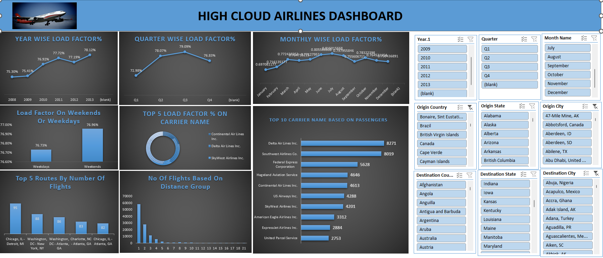
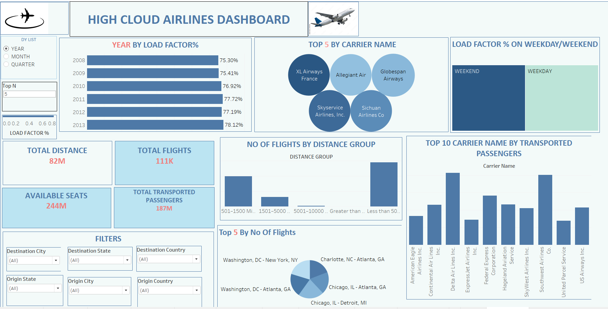

# ✈️ Airline Performance Analytics Dashboard

**SQL • Excel • Power BI • Tableau**

---

## 🚀 Project Overview

Developed an **end-to-end airline analytics BI solution** to evaluate aircraft utilization, passenger demand, carrier efficiency, and route performance using multi-tool analytics (SQL, Excel, Power BI, Tableau).
The project processes multi-source airline datasets and converts them into KPI-driven dashboards delivering actionable operational insights.

---

## 📊 Business Problem

Airline operations generate millions of flight records across multiple systems, making it difficult for decision-makers to:

* Monitor aircraft seat utilization trends
* Identify top performing routes and carriers
* Optimize seasonal demand planning
* Compare operational performance across time periods

This project solves these challenges by building an integrated **Airline KPI Intelligence Dashboard**.

---

## 📈 Key Metrics & Insights (Quantified)

### Load Factor Performance

* Load factor improved from **75.30% (2008)** to **78.12% (2013)** showing **+2.82% utilization growth**
* **Q3 achieved highest utilization (79.09%)**, while **Q1 recorded lowest (72.98%)**
* Monthly peak observed during **June–August (80%+ utilization)** indicating strong seasonal travel demand
* Weekend load factor slightly higher (**76.96%**) compared to weekday (**76.73%**), highlighting leisure-travel influence

### Carrier Efficiency

* **Globespan Airways achieved 95% load factor**, outperforming industry average by ~17%
* Major carriers (Allegiant, XL Airways, Sichuan Airlines) maintained **87–89% utilization**, indicating competitive operational efficiency
* Passenger preference analysis identified **Delta and Southwest** as leading carriers in total passengers

### Route & Distance Analysis

* High-frequency business corridors such as **Chicago–Detroit** and **Washington–New York** ranked among the most active routes
* Flight volume decreases as **distance increases**, indicating short-haul travel dominates airline operations
* Hub-based traffic analysis highlighted **Atlanta** as a key operational hub across multiple routes

---

## 🧠 Data Engineering & Modeling

* Integrated **8+ airline datasets** using Power Query and SQL joins to create a unified analytical model
* Built **date intelligence dimensions** including Year, Quarter, Financial Periods, Weekday, and Year-Month hierarchies
* Designed KPI calculations for **Load Factor %, Passenger Demand, Carrier Ranking, and Route Performance**
* Optimized dashboard data models to support interactive filtering and high-performance analytics

---

## 📊 Dashboards

### Excel Dashboard

* KPI cards for utilization and passenger metrics
* Pivot-based route and carrier comparison
* Monthly trend visualizations

---

### Power BI Dashboard

* Interactive airline KPI monitoring
* Dynamic drill-downs by carrier, route, and period
* Executive-level operational insights

---

### Tableau Dashboard

* Route performance heatmaps
* Seasonal travel demand visualization
* Carrier benchmarking analysis

---

## ⭐ Business Impact

* Enabled **data-driven route planning and fleet optimization insights**
* Identified **seasonal utilization gaps** supporting demand-based scheduling strategies
* Provided **carrier benchmarking analytics** for competitive performance monitoring
* Delivered executive dashboards reducing manual reporting effort and improving decision visibility

---

## 🧰 Tools & Technologies

* SQL – Data extraction, joins, KPI queries
* Excel – Data cleaning, PivotTables, dashboard creation
* Power BI – Interactive business intelligence dashboards
* Tableau – Advanced visualization and route analytics
* Power Query – Data integration and transformation

---

## 📌 Conclusion

This project demonstrates a **production-ready Business Intelligence analytics workflow**, combining data engineering, KPI modeling, and interactive dashboards to support airline operational decision-making and performance optimization.

---

### 💼 Recruiter Note (Portfolio Highlight)

This project showcases **real-world business KPI modeling, multi-tool BI development, and quantified insight generation**, demonstrating strong readiness for **Data Analyst / BI Analyst roles**.
